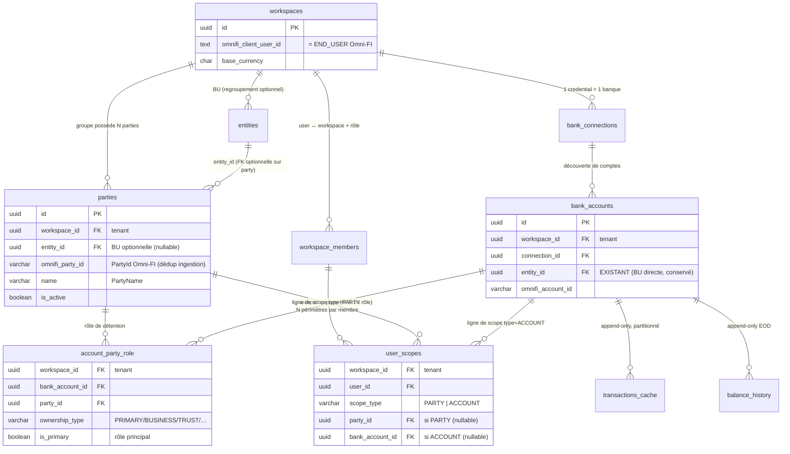

# Plan — Architecture multi-tenant Omnicane (Groupe → Parties → Comptes, périmètres fins)

> **Phase : CONSIGNATION DE CONCEPTION UNIQUEMENT** (CLAUDE.md règle 1).
> Aucune ligne de code applicatif, **aucune migration**, aucun schéma Drizzle n'est
> produit ni modifié par ce document. C'est un document de conception **à valider
> ensemble** avant toute phase d'implémentation. Sur votre « go », j'ouvrirai une
> requête d'implémentation distincte par lot (§5).
>
> - **Auteur** : Architecte Back-end (frontière gouvernance : serveur + contrat + DB).
> - **Date** : 2026-06-26. Branche : `docs/archi-multi-tenant`.
> - **Décisions amont déjà actées** (ne pas re-litiger ici) : Option B
>   (`ROADMAP-OMNICANE.md` §1-2) — UN workspace « Groupe Omnicane », tout vit sous le
>   workspace ; deux étages d'isolation RLS (`CLAUDE.md` → « Entités multi-tenant »).
> - **Arbitrages tranchés avec le PO pour CE document (2026-06-26)** :
>   1. **La « Partie » est une NOUVELLE table dédiée** (`parties`, alignée sur le
>      `PartyId` Omni-FI), **distincte** de la table `entities` déjà en base. Les
>      `entities` (BU : Sucrière, Énergie…) restent un **regroupement business
>      optionnel AU-DESSUS** des parties.
>   2. **Le périmètre d'un utilisateur cible des PARTIES **ET** des COMPTES** (deux
>      types de lignes de scope) ; le droit effectif = **union(parties autorisées) ∪
>      comptes autorisés**, jusqu'à **un seul compte d'une seule banque**.

---

## 0. Ce qui existe déjà (à RÉUTILISER) vs ce qu'on AJOUTE — synthèse 5 lignes

1. **EXISTE & RÉUTILISÉ — l'étage tenant** : `workspaces` + RLS `workspace_id`
   (POLITIQUE_TENANT, fail-closed `nullif`), `withWorkspace` (`src/server/db/tenancy.ts`)
   qui pose les GUC transactionnels et re-valide la membership à chaque requête. **Frontière
   dure inchangée.**
2. **EXISTE & RÉUTILISÉ — l'ossature données** : `bank_connections` (1 credential = 1
   banque) → `bank_accounts` → `transactions_cache` (partitionné, append-only) +
   `balance_history` (append-only). Ingestion idempotente page-based (`/transactions`,
   `Links.Next`/`Meta.TotalPages` — **pas** de `/sync` curseur, confirmé non déployé).
3. **EXISTE & RÉUTILISÉ — un PREMIER étage de périmètre** : `entities` +
   `bank_accounts.entity_id` (nullable) + `member_entity_scopes` (N:N user↔entité) + la
   policy RLS **RESTRICTIVE `entity_scope` FOR ALL** sur `bank_accounts` pilotée par le 3ᵉ
   GUC `app.current_entity_scope` (posé `tenancy.ts:174-216`). Le pattern **ENTITY-READ-JOIN1**
   (joindre `bank_accounts` pour faire hériter le scope aux tables filles) est déjà éprouvé
   dans 4 repositories (`dashboard.ts`, `transactions.ts`, `insights.ts`,
   `regles-categorisation.ts`).
4. **À AJOUTER** : (a) la couche **`parties`** + table de liaison **`account_party_role`**
   (compte↔party, calquée Omni-FI), alimentées à l'**ingestion** via `PartyId`/`PartyName`
   (lève la dette ENTITY-PARTY1) ; (b) le **scope par compte** en plus du scope existant
   (généralisation de `member_entity_scopes` → un modèle de périmètre **multi-cible**
   party/account) ; (c) un **sélecteur de vue réutilisable** présent sur **chaque page**,
   borné par le droit.
5. **PRINCIPE DIRECTEUR (ne pas casser)** : on **n'inverse ni ne relâche jamais** l'étage 1
   (tenant). La couche party/compte **s'ajoute sous le tenant**, dans la **même mécanique RLS
   fail-closed** qui a déjà fait ses preuves. **Une seule ingestion au niveau groupe** ; les
   utilisateurs lisent **NOTRE base**, jamais l'API Omni-FI directement (coût/quota).

> **Clarification de vocabulaire (structurante pour tout le document)** — trois niveaux à
> ne JAMAIS confondre :
> - **`party`** (NOUVEAU) = l'**entité légale** au sens Omni-FI (`PartyId` : société,
>   individu) qui **possède** des comptes. C'est la maille de droit la plus naturelle.
> - **`entity`** (EXISTANT) = la **Business Unit Omnicane** (Sucrière, Énergie…), un
>   regroupement **business interne** au-dessus des parties. Optionnel pour le droit.
> - **`workspace`** = le **Groupe** (« Omnicane »), l'unique frontière de tenant.
>
> Omni-FI sépare déjà **END_USER** (tenancy : qui possède la donnée) de **USER** (auth : qui
> se connecte). Ce document calque cette séparation : `workspace.omnifi_client_user_id` =
> END_USER (le Groupe possède **une** ingestion) ; nos `users` + périmètres = qui a le **droit
> de voir**.

---

## 1. Modèle de données (le cœur)

Le modèle se lit en **trois couches** strictement séparées. On ne mélange jamais « qui
possède la donnée » (couche A) et « qui a le droit de la voir » (couche B) ; la couche C est
le **pont** qui borne les lectures.

### 1.0 Vue d'ensemble (mermaid ER)



#### Lecture des relations (1-N / N-N)

| Relation | Cardinalité | Sens | Note |
|---|---|---|---|
| `workspaces` → `parties` | 1-N | un Groupe regroupe N parties | liste **plate** rattachée au groupe (pas d'arbre de détention) |
| `entities` → `parties` | 1-N (optionnel) | une BU regroupe N parties | `parties.entity_id` **nullable** ; le regroupement BU est facultatif |
| `parties` ↔ `bank_accounts` | **N-N** | une party détient N comptes ; un compte peut avoir plusieurs rôles de party (joint, mandat…) | matérialisé par **`account_party_role`** (calque Omni-FI `ACCOUNT_PARTY_ROLE`) |
| `bank_accounts` → `transactions_cache` / `balance_history` | 1-N | un compte porte N transactions / N points EOD | append-only ; héritent le scope **par jointure** |
| `workspace_members` → `user_scopes` | 1-N | un membre a **N périmètres** | une ligne = un droit élémentaire (une party OU un compte) |
| `parties` / `bank_accounts` → `user_scopes` | 1-N | une party/compte peut être cité dans N périmètres | la cible du droit |

> **Pourquoi `account_party_role` en N-N et pas une simple colonne `party_id` sur
> `bank_accounts`** : Omni-FI modélise explicitement un **rôle de détention**
> (`OwnershipType` ∈ `PRIMARY`/`SECONDARY`/`JOINT_OWNER`/`TRUST`/`BUSINESS`/
> `POWER_OF_ATTORNEY`) — un compte joint appartient à **plusieurs** parties. Une colonne
> unique écraserait cette réalité et nous coincerait au premier compte multi-détenteurs. La
> table de liaison est le **modèle fidèle** et le seul qui supporte « filtrer par party »
> sans ambiguïté. **`bank_accounts.entity_id` (BU directe) reste conservé** : il répond à un
> autre besoin (rattacher un compte à une BU **sans** passer par une party, ex. compte
> Omnicane non encore relié à une société). Party (légal) et entity (BU) sont **deux axes
> orthogonaux** de regroupement.

---

### 1.1 COUCHE A — DONNÉES (qui POSSÈDE la donnée : le Groupe)

Toutes scopées `workspace_id` (étage 1, RLS tenant inchangée).

#### A.1 — `workspaces` (EXISTANT, inchangé)
Le Groupe. `omnifi_client_user_id` = l'END_USER Omni-FI (une seule ingestion groupe).

#### A.2 — `entities` (EXISTANT, inchangé au socle ; rôle clarifié)
La **BU** Omnicane. Reste tel quel (`id`, `workspace_id`, `name`, `code`, `is_active`).
Désormais **regroupe des parties** (via `parties.entity_id`) **et/ou** des comptes
directement (via `bank_accounts.entity_id`, déjà là). Aucune migration sur cette table.

#### A.3 — `parties` (NOUVELLE)
L'entité légale au sens Omni-FI, **propriété du Groupe**.

| Colonne | Type | Contraintes / notes |
|---|---|---|
| `id` | `uuid` PK | `defaultRandom()` |
| `workspace_id` | `uuid` NOT NULL | FK → `workspaces.id` ; **frontière tenant** (étage 1) |
| `entity_id` | `uuid` **NULLABLE** | FK **composite** `(entity_id, workspace_id) → entities(id, workspace_id)` ON DELETE RESTRICT ; NULL = party non rattachée à une BU |
| `omnifi_party_id` | `varchar(64)` NOT NULL | `PartyId` Omni-FI ; **clé de dédup à l'ingestion** |
| `name` | `varchar(255)` | `PartyName` (nullable côté API → nullable ici) |
| `ownership_type` | `varchar(24)` NULL | hint global si fourni hors rôle (le rôle fin vit dans `account_party_role`) |
| `is_active` | `boolean` NOT NULL | `default true` — archivage logique, jamais de DELETE applicatif |
| `created_at` | `timestamptz` NOT NULL | `defaultNow()` |

- **`UNIQUE (id, workspace_id)`** → cible des FK composites scopées (pattern `entities`,
  `categories`).
- **`UNIQUE (workspace_id, omnifi_party_id)`** → **idempotence d'ingestion** (upsert d'une
  party par `PartyId` dans le groupe). ⚠️ Volontairement scopé `(workspace_id, …)` et **pas**
  global, pour ne pas refaire le pari d'unicité globale discuté pour
  `omnifi_connection_id`/`omnifi_account_id` (cf. commentaires schema.ts:233-281).
- `INDEX (workspace_id)`, `INDEX (workspace_id, entity_id)`.
- **RLS** : `pgPolicy("tenant_isolation", POLITIQUE_TENANT)` + `.enableRLS()` + **FORCE**
  (migration custom — drizzle-kit n'émet pas FORCE, cf. 0001/0003).

#### A.4 — `account_party_role` (NOUVELLE — liaison N-N compte ↔ party)
Calque de `ACCOUNT_PARTY_ROLE` Omni-FI. Le **rôle de détention** d'un compte par une party.

| Colonne | Type | Contraintes / notes |
|---|---|---|
| `workspace_id` | `uuid` NOT NULL | FK → `workspaces.id` ; tenant + RLS |
| `bank_account_id` | `uuid` NOT NULL | (FK composite ci-dessous) |
| `party_id` | `uuid` NOT NULL | (FK composite ci-dessous) |
| `ownership_type` | `varchar(24)` NOT NULL | `PRIMARY`/`SECONDARY`/`JOINT_OWNER`/`TRUST`/`BUSINESS`/`POWER_OF_ATTORNEY` |
| `is_primary` | `boolean` NOT NULL | `default false` — vrai pour le rôle principal (1 par compte côté UI) |
| `created_at` | `timestamptz` NOT NULL | `defaultNow()` |

- **`PRIMARY KEY (workspace_id, bank_account_id, party_id)`** → idempotence (un couple
  compte/party n'a qu'une ligne ; le rôle peut être mis à jour).
- **FK composite compte** : `(bank_account_id, workspace_id) → bank_accounts(id,
  workspace_id)` ON DELETE CASCADE.
  ⚠️ **Pré-requis** : `bank_accounts` doit exposer `UNIQUE (id, workspace_id)` (à ajouter en
  même temps — aujourd'hui sa PK est `id` seul). Cascade **légitime** : c'est une table de
  liaison/référentiel, **NON append-only** (effacer une connexion peut faire tomber le compte
  et donc ses rôles, sans toucher l'historique transactionnel qui reste régi par le trigger
  no-delete).
- **FK composite party** : `(party_id, workspace_id) → parties(id, workspace_id)` ON DELETE
  RESTRICT (on archive une party référencée, on ne l'efface pas).
- `INDEX (workspace_id, party_id)` (résoudre « comptes d'une party »), `INDEX
  (workspace_id, bank_account_id)`.
- **RLS** : `tenant_isolation` + FORCE. **Hérite aussi le scope party/account** par
  construction (voir §2.2 — la jointure sur `bank_accounts` fait mordre `entity_scope`/le
  nouveau scope).

#### A.5 — `bank_accounts` (EXISTANT) — ajouts mineurs
- Conserver `entity_id` (BU directe, déjà là).
- **AJOUTER `UNIQUE (id, workspace_id)`** (cible des nouvelles FK composites de
  `account_party_role` et `user_scopes` type ACCOUNT). Expand-safe (contrainte additive, ne
  casse aucune ligne ni le code N-1).
- **Aucune** colonne `party_id` directe sur `bank_accounts` : la détention passe **toujours**
  par `account_party_role` (évite l'ambiguïté multi-détenteurs).

#### A.6 — `transactions_cache` / `balance_history` (EXISTANT, inchangé)
**Aucune dénormalisation** de `party_id` ni `entity_id` ici (append-only, partitionné ;
réassigner une party ne doit **jamais** réécrire l'historique). Le périmètre se propage **par
jointure** sur `bank_accounts` (puis éventuellement `account_party_role`). Voir §2.2.

---

### 1.2 COUCHE B — UTILISATEURS & PÉRIMÈTRES (qui a le DROIT de voir)

#### B.1 — `users` + `workspace_members` (EXISTANT, inchangé)
`users` = l'auth (le USER Omni-FI). `workspace_members` = appartenance au Groupe + **rôle**
(`ADMIN`/`MANAGER`/`VIEWER`, enum inchangé). Le **rôle métier** (« financial manager »,
« financial strategist ») demandé est **un libellé fonctionnel**, pas un nouveau rôle
technique : il se rend via le périmètre + le rôle existant (cf. §3.1). Si un libellé doit
apparaître dans l'UI, il est porté par une colonne descriptive `workspace_members.job_title
varchar(80) NULL` (cosmétique, **jamais** une clé d'autorisation).

#### B.2 — `user_scopes` (NOUVELLE — remplace/généralise `member_entity_scopes`)
Le **périmètre** : N lignes par membre, chacune ciblant **une party OU un compte**. C'est la
**couche de droit**, jamais alimentée par un paramètre client (gérée par un ADMIN).

| Colonne | Type | Contraintes / notes |
|---|---|---|
| `workspace_id` | `uuid` NOT NULL | FK → `workspaces.id` ; tenant + RLS |
| `user_id` | `uuid` NOT NULL | (FK composite membership ci-dessous) |
| `scope_type` | `varchar(8)` NOT NULL | **`PARTY`** ou **`ACCOUNT`** (CHECK) |
| `party_id` | `uuid` NULL | renseigné **ssi** `scope_type='PARTY'` |
| `bank_account_id` | `uuid` NULL | renseigné **ssi** `scope_type='ACCOUNT'` |
| `created_at` | `timestamptz` NOT NULL | `defaultNow()` |

- **CHECK d'exclusivité** :
  `(scope_type='PARTY' AND party_id IS NOT NULL AND bank_account_id IS NULL)`
  **OU** `(scope_type='ACCOUNT' AND bank_account_id IS NOT NULL AND party_id IS NULL)`.
  Une ligne cible **exactement une** cible. Pas d'état bâtard.
- **PK / unicité** : `UNIQUE (workspace_id, user_id, scope_type, COALESCE(party_id,
  bank_account_id))` — idempotence (pas deux fois le même droit). (En pratique : index unique
  partiels — un sur `(ws, user, party_id)` WHERE PARTY, un sur `(ws, user, bank_account_id)`
  WHERE ACCOUNT.)
- **FK composite membership** : `(user_id, workspace_id) → workspace_members(user_id,
  workspace_id)` ON DELETE **CASCADE** (retirer un membre purge ses droits — table de droits,
  légitime).
- **FK composite party** : `(party_id, workspace_id) → parties(id, workspace_id)` ON DELETE
  RESTRICT (déférable au sens : archiver, pas effacer).
- **FK composite compte** : `(bank_account_id, workspace_id) → bank_accounts(id,
  workspace_id)` ON DELETE CASCADE (si le compte disparaît, le droit le ciblant disparaît).
- `INDEX (workspace_id, user_id)` → résolution du périmètre à l'ouverture de session.
- **RLS** : `tenant_isolation` + FORCE.

> **Sémantique du périmètre** (clé) :
> - **0 ligne** `user_scopes` pour `(user, workspace)` ⇒ **Vision Globale** (voit tout le
>   Groupe). *Identique à l'actuel `member_entity_scopes` vide.*
> - **≥1 ligne** ⇒ **Vision restreinte**. Le **droit effectif** = **union** des comptes des
>   parties citées **∪** les comptes cités directement. Descendre à **un seul compte** = une
>   seule ligne `ACCOUNT`. C'est la couche C (§1.3) qui résout cette union en liste de
>   comptes.

> **Migration depuis l'existant `member_entity_scopes`** : on **ne perd rien**. Deux voies au
> choix (à trancher en validation, défaut recommandé = (i)) :
> - **(i) Garder `member_entity_scopes` pour l'axe BU, ajouter `user_scopes` pour
>   party/compte.** Le scope BU (entité) **ET** le scope party/compte coexistent ; le droit
>   effectif est l'**union des trois axes**. Zéro migration de données, additif pur.
> - **(ii) Absorber l'axe BU dans `user_scopes`** (ajouter `scope_type='ENTITY'` +
>   `entity_id`). Plus uniforme, mais migre les lignes existantes et complexifie le CHECK.
>   Reporté sauf besoin.
> Le présent document est rédigé sur **(i)** (le moins risqué) ; le résolveur §1.3 prend les
> **trois** sources en compte.

#### B.3 — Rôle métier (financial manager / strategist)
Pas de table nouvelle. Le besoin « rôle + un ou plusieurs périmètres » se lit :
**rôle technique** (`workspace_members.role`) **×** **périmètre** (`user_scopes`). Un
« financial strategist » multi-BU = un VIEWER (ou MANAGER) avec plusieurs lignes `PARTY`.
Détail RBAC en §3.

---

### 1.3 COUCHE C — LE PONT (résolution du périmètre → comptes visibles)

C'est **le lien** entre A (données) et B (droits). Il transforme un membre en une **liste de
`bank_account.id` autorisés**, puis applique la **vue courante** (choix UI) **bornée** par ce
droit.

```
résoudreComptesAutorises(ctx) :                      [calculé dans withWorkspace, JAMAIS côté client]
  si user_scopes(ctx.user, ctx.ws) == ∅  →  GLOBALE   (aucun filtre — voit tout le tenant)
  sinon :
    comptesParParty   = SELECT bank_account_id
                        FROM account_party_role
                        WHERE party_id IN (parties citées dans user_scopes)   -- via scope_type=PARTY
    comptesParEntite  = SELECT id FROM bank_accounts
                        WHERE entity_id IN (entités de member_entity_scopes)  -- axe BU existant (voie i)
    comptesDirects    = (bank_account_id des lignes scope_type=ACCOUNT)
    DROIT = comptesParParty ∪ comptesParEntite ∪ comptesDirects               -- ensemble d'UUID comptes
```

Le **DROIT** (ensemble d'UUID de comptes) est ensuite posé comme **filtre RLS structurel**
(§2). La **vue courante** (sélecteur UI : toutes / party X / parties X+Y / compte Y) est une
**intersection** appliquée par-dessus, **toujours bornée** par le DROIT (un membre ne peut pas
choisir une vue plus large que son droit — `withWorkspace` intersecte, jamais n'élargit).

> **Décision de matérialisation du filtre — `app.current_account_scope` (CSV d'UUID
> comptes), pas une liste de parties.** On résout le périmètre **en comptes** côté serveur et
> on pose **un GUC d'UUID de comptes**. Raison : la garde RLS la plus simple et la plus sûre
> est **« ce compte est-il dans la liste autorisée ? »** posée **sur `bank_accounts`** —
> exactement le mécanisme déjà en place pour `entity_scope`. Mettre des `party_id` dans le GUC
> obligerait la policy à faire un sous-`SELECT` sur `account_party_role` à chaque ligne
> (coûteux, et une policy qui fait des jointures est fragile). On garde la policy **triviale**
> et on met l'intelligence **dans le résolveur serveur** (testable, une fois par requête).

---

### 1.4 Récapitulatif des garanties d'isolation (couche par couche)

| Table | RLS tenant | Scope party/compte (étage 2) | FK composites scopées | DELETE |
|---|---|---|---|---|
| `parties` (NEW) | ✅ + FORCE | — (c'est une cible) | `UNIQUE(id, ws)` + `(entity_id, ws)→entities` | liste blanche |
| `account_party_role` (NEW) | ✅ + FORCE | hérité (jointure bank_accounts) | `(bank_account_id, ws)→bank_accounts`, `(party_id, ws)→parties` | liste blanche |
| `bank_accounts` (col./contr.) | ✅ (déjà) | ✅ policy `account_scope` (généralise `entity_scope`) | + `UNIQUE(id, ws)` (NEW) | déjà |
| `user_scopes` (NEW) | ✅ + FORCE | — (c'est le droit) | `(user_id, ws)→members`, `(party_id, ws)→parties`, `(bank_account_id, ws)→bank_accounts` | liste blanche |
| `transactions_cache` / `balance_history` | ✅ (déjà) | hérité par JOINTURE | — | **trigger no-delete (intouché)** |

**Triple garantie reconduite** : (1) RLS tenant fail-closed, (2) FK composites scopées
(party/compte/entité d'un autre tenant = impossible en base), (3) policy RLS de périmètre
fail-closed pilotée par un GUC **dérivé du contexte serveur**, jamais d'un paramètre client.

---

## 2. Stratégie d'ingestion (groupe-unique)

### 2.1 Principe : UNE passe, au niveau Groupe, page-based, idempotente

L'ingestion est **globale au workspace** et **ne dépend d'AUCUN périmètre utilisateur** (le
filtrage vient **après**, à la lecture). Elle tourne en **Vision Globale** (service/ADMIN,
GUC de scope vide), comme aujourd'hui `upsertCompte` (cf. CLAUDE.md « Écriture bornée »).

Ordre des appels (tous **page-based**, `Links.Next`/`Meta.TotalPages` ; **pas** de `/sync`
curseur — confirmé non déployé, mémoire [[prod-omnifi-pas-deployee]]) :

```
1. (déjà) link-token / link-exchange → bank_connections (ConnectionId)
2. (déjà) GET /sync/job/{JobId}/accounts → bank_accounts          [découverte de comptes]
       ⇢ OmniFiAccount porte PartyId / PartyName / OwnershipType  ← on les EXPLOITE désormais
3. (NEW) à partir des comptes : upsert parties + account_party_role  (depuis l'objet compte)
       (optionnel, plus tard) GET /parties/{PartyId}/accounts pour consolider la détention
4. (déjà) GET /accounts/{AccountId}/transactions (pages) → transactions_cache
5. (déjà) GET /accounts/{AccountId}/balances/history (pages) → balance_history
```

### 2.2 Mapping Omni-FI → nos tables

| Entité Omni-FI | Champ source | Notre table.colonne | Règle |
|---|---|---|---|
| **API_CLIENT** | (partenaire B2B) | — | hors modèle (c'est nous) |
| **END_USER** | `ClientUserId` | `workspaces.omnifi_client_user_id` | **1 EndUser = 1 Groupe** (déjà) |
| **INSTITUTION** | `InstitutionId`/`InstitutionName` | `bank_connections.institution_id`/`institution_name` | déjà (DASH-INST1) |
| **CONNECTION** | `ConnectionId` | `bank_connections.omnifi_connection_id` | déjà, upsert idempotent |
| **ACCOUNT** | `AccountId`, `Currency`, `Balances`, `AccountName` | `bank_accounts.*` | déjà, upsert idempotent ; **`entity_id` jamais écrasé** au re-sync |
| **PARTY** | `PartyId`, `PartyName`, `OwnershipType` | **`parties.*`** (NEW) | **upsert par `(workspace_id, omnifi_party_id)`** ; `name` rafraîchi ; `entity_id`/`is_active` **jamais** écrasés (assignation BU = humaine) |
| **ACCOUNT_PARTY_ROLE** | `OmniFiAccount.PartyId` + `OwnershipType` (et/ou `GET /parties/{id}/accounts`) | **`account_party_role.*`** (NEW) | **upsert par `(ws, bank_account_id, party_id)`** ; `ownership_type`/`is_primary` rafraîchis |
| **TRANSACTION** | `OmniFiTransaction` (pages) | `transactions_cache.*` | déjà ; tombstone `is_removed`, jamais DELETE |
| **BALANCE** | `HistoricalBalances` (pages) | `balance_history.*` | déjà ; append-only EOD |

### 2.3 Idempotence & invariants (reconduits)

- **Upsert partout** (comme l'ingestion actuelle) : `onConflictDoUpdate` sur les clés
  `(workspace_id, omnifi_*)`. Re-jouer une ingestion ne crée pas de doublon (preuve à
  reconduire dans la suite isolation, comme DASH-DEDUP1).
- **Champs « humains » jamais écrasés au re-sync** : `parties.entity_id`,
  `parties.is_active`, `bank_accounts.entity_id` (déjà), et toute assignation manuelle. Un
  rattachement décidé par un ADMIN **survit** à la re-synchro (même invariant que §1.5 du plan
  Entités existant). ⚠️ à **exclure explicitement** du `set` de l'upsert.
- **`PartyId` null** (l'API l'autorise) : le compte reste **sans party** → visible
  uniquement en Vision Globale ou via un scope `ACCOUNT`/`entity_id` direct. **Pas de party
  fabriquée.** (Même esprit fail-closed que « compte `entity_id` NULL invisible en Vision
  restreinte ».)
- **Rien dans ce flux ne lit `user_scopes`** : l'ingestion est aveugle aux droits. C'est une
  **propriété de sécurité** (pas un détail) : aucune fuite ne peut naître de l'ingestion, elle
  ne fait qu'écrire la donnée brute du Groupe.
- **Coût/quota** : une passe groupe, pas d'appel par utilisateur. Les lectures applicatives
  tapent **NOTRE base** (RLS), **jamais** l'API. (Aligne l'objectif « ne pas sur-requêter
  Omni-FI ».)

---

## 3. Couche d'autorisation & filtrage (à la lecture)

### 3.1 RBAC — pas de nouveau rôle technique (recommandé)

`WORKSPACE_ROLES = {ADMIN, MANAGER, VIEWER}` **inchangé** (enum + CHECK). Le besoin
« financial manager / strategist » = **rôle existant × périmètre** :
- **Gestion** (créer/renommer/archiver parties & entités, **assigner** compte↔party,
  **définir les périmètres** des membres) = **ADMIN-only** (garde applicative `ctx.role ===
  "ADMIN"`, même pattern que `admin/entites`).
- **Lecture** : tout membre lit **dans la limite de son périmètre** (§3.2). Un VIEWER scopé =
  « Vision restreinte » ; un membre **sans** scope = « Vision Globale ».
- Libellé métier éventuel = `workspace_members.job_title` (cosmétique, jamais une autorité).

> Justification du « pas de `GROUP_AUDITOR`/`STRATEGIST` technique » : toucher l'enum + le
> CHECK + le JWT + la suite IDOR pour un bénéfice nul au MVP. Reconduit du plan Entités (§3.1).
> Voie balisée si « lecture seule globale stricte » devient nécessaire (incrément dédié).

### 3.2 Où le filtre s'applique — la RLS, jamais le `.tsx` (fail-closed)

Le filtre de périmètre vit dans **deux gardes structurelles RLS**, posées **sous** le tenant
(qui reste intouché). Le **résolveur** §1.3 calcule, à chaque requête, dans `withWorkspace` :

1. **GUC `app.current_account_scope`** (NEW) = CSV des **UUID de comptes autorisés** (le
   DROIT résolu), **ou vide** = Vision Globale. Calculé **exclusivement** depuis `user_scopes`
   + `member_entity_scopes` + `account_party_role` (jointures serveur), **jamais** d'un
   paramètre client.
2. **GUC `app.current_view_filter`** (NEW, optionnel) = CSV des comptes de la **vue courante**
   (sélecteur UI), **toujours intersecté** côté serveur avec le DROIT (un choix UI ne peut
   jamais élargir). Si le sélecteur est « toutes », ce GUC est vide (= le DROIT s'applique
   seul).

**Policy RLS `account_scope` sur `bank_accounts`** (généralise `entity_scope`,
**RESTRICTIVE FOR ALL** pour se combiner en AND avec `tenant_isolation` PERMISSIVE) :

```sql
-- USING (lecture + cible d'UPDATE/DELETE) ET WITH CHECK (INSERT/UPDATE) :
(
  nullif(current_setting('app.current_account_scope', true), '') IS NULL          -- Vision Globale (DROIT)
  OR id = ANY (string_to_array(current_setting('app.current_account_scope', true), ',')::uuid[])
)
AND (
  nullif(current_setting('app.current_view_filter', true), '') IS NULL            -- pas de filtre de vue
  OR id = ANY (string_to_array(current_setting('app.current_view_filter', true), ',')::uuid[])
)
```

- **Tables filles** (`transactions_cache`, `balance_history`, `account_party_role`) :
  **héritent** le scope **par JOINTURE** sur `bank_accounts` — règle **ENTITY-READ-JOIN1**
  déjà appliquée dans 4 repositories, **à étendre** (jamais lire une table fille sans joindre
  `bank_accounts`). **Aucune** policy ni GUC dupliqué sur l'append-only.
- **`account_party_role`** porte **aussi** `tenant_isolation` ; son scope party/compte vient
  de la jointure `bank_accounts`. Lister « les parties que je peux voir » = `SELECT DISTINCT
  party_id FROM account_party_role JOIN bank_accounts …` → la RLS filtre les comptes hors
  périmètre, donc on ne voit que les parties **réellement** dans le droit.

> **Pourquoi remplacer/renommer `entity_scope` par `account_scope`** : la maille de filtrage
> devient **le compte** (plus fine, couvre party **et** compte **et** entité d'un coup). La
> policy `entity_scope` actuelle (GUC `app.current_entity_scope`, CSV d'`entity_id`) devient
> un **cas particulier** : le résolveur traduit `entity_id` → comptes et alimente
> `account_scope`. **Compatibilité** : on peut conserver `entity_scope` en parallèle au début
> (additif) puis la retirer une fois `account_scope` prouvé — décision de migration en §5.

### 3.3 Éviter toute fuite cross-périmètre (modes de défaillance traités)

- **Oubli de `WHERE`/jointure dans un repository** → la RLS `account_scope` **rattrape** sur
  `bank_accounts` ; une table fille lue **sans** joindre `bank_accounts` serait le seul trou →
  c'est précisément l'invariant ENTITY-READ-JOIN1 (déjà un gate). À **réaffirmer** dans
  CLAUDE.md et la suite isolation.
- **Élargissement via le sélecteur** → impossible : `current_view_filter` est **intersecté**
  serveur avec le DROIT ; un compte hors droit demandé par l'UI **disparaît** (0 ligne), pas
  d'erreur 403 (pas d'oracle).
- **Compte sans party / `entity_id` NULL** → invisible en Vision restreinte (n'entre dans
  aucune branche du DROIT), visible seulement en Vision Globale (ADMIN, sas).
- **Membre scopé qui « retombe » en Globale** → impossible : un membre avec ≥1 ligne
  `user_scopes`/`member_entity_scopes` reçoit **toujours** son CSV (fail-closed, comme
  `tenancy.ts:187`).
- **Écriture hors périmètre** (catégorisation, assignation) → la policy `account_scope`
  **FOR ALL** borne aussi `WITH CHECK` : un membre restreint ne peut cibler/déplacer un compte
  hors de son droit. L'assignation compte↔party / périmètres reste **ADMIN-only** (garde
  applicative en plus de la RLS — les deux gardes complémentaires, cf. CLAUDE.md).

### 3.4 Modification de `withWorkspace` (surface sensible — cross-review obligatoire)

Le point névralgique anti-IDOR. Extension **ciblée**, dans la continuité du 3ᵉ GUC déjà posé
(`tenancy.ts:174-216`) :
- Après la re-validation de la membership, le résolveur §1.3 lit `user_scopes` (+
  `member_entity_scopes` pour l'axe BU) ; s'il y a ≥1 ligne, il **résout en comptes** (jointure
  `account_party_role` pour les parties) et pose `app.current_account_scope` via
  `set_config(..., true)` **paramétré** (CSV d'UUID lus en base — zéro interpolation, règle 2).
  0 ligne → GUC non posé (Globale).
- `app.current_view_filter` posé **seulement** si l'appelant fournit une vue courante, **après
  intersection** avec le DROIT.
- `WorkspaceContext` enrichi d'un champ lisible (ex. `accountScope: string[] | "GLOBALE"`)
  pour les repositories — **sans** être l'autorité (l'autorité reste la RLS).
- **Coût/risque** : toute modif de `withWorkspace` = **cross-review contradictoire** (règle 6)
  + cas ajoutés à la suite isolation. La résolution party→comptes est **une requête de plus**
  par session ouverte (indexée `account_party_role(workspace_id, party_id)`) — acceptable, à
  surveiller si N parties explose (mémoïsable par session si besoin, dette à tracer).

---

## 4. UX / UI — sélecteur de périmètre réutilisable

> **Frontière de gouvernance** : le rendu `.tsx` appartient au **Front**. Cette section est
> une **esquisse de contrat** (props, comportement, états), **sans code**. Le Backend fournit
> la **donnée** (liste des parties/comptes visibles, vue courante) et **borne** le choix.

### 4.1 `<SelecteurPerimetre/>` — présent sur CHAQUE page

Un composant unique, monté dans le header (ou une barre de filtre sous le header), réutilisé
par dashboard / transactions / graphiques / échéances. **Réutilise les primitives existantes**
(`states/primitives.tsx`, tokens UI_GUIDELINES) — pas de carte ad-hoc.

- **Contenu** : une arborescence légère à **2 niveaux** → **Party** › **Comptes de la party**,
  + une section « Comptes directs » (scopes ACCOUNT hors party). Multi-sélection (cases), avec
  « Tout sélectionner » au niveau party.
- **Données** (fournies par le Backend, déjà filtrées par le DROIT) :
  ```ts
  interface OptionPerimetre {
    parties: Array<{
      id: string; name: string;
      comptes: Array<{ id: string; accountName: string; institutionName: string | null; currency: string }>;
    }>;
    comptesSansParty: Array<{ id: string; accountName: string; institutionName: string | null; currency: string }>;
  }
  ```
  ⚠️ Cette liste **est déjà bornée** par le périmètre du membre (la RLS l'a filtrée) — l'UI ne
  voit jamais une party/compte hors droit, donc **ne peut pas** en proposer.
- **Choix → vue courante** : la sélection produit un ensemble de `bank_account_id` (résolu :
  cocher une party = tous ses comptes visibles). Envoyé au serveur, **intersecté** avec le
  DROIT, posé en `current_view_filter`.
- **État par défaut** : « Toutes mes données » (DROIT entier — pas de `view_filter`).
- **Persistance** : le choix de vue est une **préférence d'affichage** (cookie/`searchParams`),
  **jamais** un droit. Reset = retour au DROIT entier.

### 4.2 Vue consolidée ↔ vue fine — comment elles cohabitent

- **Vue consolidée (Groupe / multi-party)** : le `view_filter` est vide ou large → les
  agrégats existants (solde multidevise `syntheseMoisParDevise`, cashflow, top vendors)
  s'additionnent **par devise** (jamais cross-devise — convention DASH-SOLDE1 reconduite).
- **Vue fine (un compte)** : `view_filter` = un seul UUID → **toutes** les pages se
  restreignent à ce compte (dashboard, liste transactions, courbe), **sans changer une ligne
  de logique d'agrégation** : la RLS a déjà réduit l'ensemble, les `GROUP BY devise` opèrent
  sur 1 compte. C'est l'avantage de pousser le filtre dans la RLS plutôt que dans chaque
  composant.
- **Indicateur de contexte** : un fil d'Ariane / chip « Vue : Sucrière › Compte courant Absa »
  rappelle le filtre actif sur **chaque** page (cohérence). Un membre Vision restreinte voit
  un libellé « Périmètre : 3 parties » (informatif, non cliquable au-delà de son droit).

### 4.3 Esquisse des écrans d'administration (ADMIN-only, rôle Front)

- **`/admin/parties`** : liste des parties (issues de l'ingestion), rattachement optionnel à
  une **BU** (`entity_id`), archivage. Comptes rattachés affichés via `account_party_role`.
- **`/admin/entites`** (EXISTANT) : conservé pour l'axe BU direct + (nouveau) rattachement de
  parties.
- **`/admin/membres` › périmètres** : éditeur de `user_scopes` d'un membre — ajouter des
  parties et/ou des comptes ; « aucun = Vision Globale » explicite. Réutilise le pattern
  `definirScopesMembre` déjà livré (généralisé party+compte).
- **Sas « comptes/ parties à rattacher »** : comptes dont le `PartyId` est NULL ou la party
  non rattachée à une BU → file de traitement ADMIN (même esprit que le sas Entités).

---

## 5. Plan d'implémentation par étapes (ordre sûr, dépendances explicites)

> Découpage en lots **livrables et testables**, du **plus structurel et le moins risqué** vers
> le **plus sensible**. Modèle de données → ingestion → autorisation → UX. Chaque lot = une
> requête d'implémentation distincte référençant ce document (règle 1), avec sa cross-review.

| Lot | Contenu | Dépend de | Risque de casse | Protection | Revue |
|---|---|---|---|---|---|
| **L0** | `bank_accounts ADD UNIQUE(id, workspace_id)` (pré-requis FK composites) | — | quasi nul (additif) | contrainte additive, code N-1 OK | cross-review DB |
| **L1** | Migration : `parties`, `account_party_role` (+ RLS/FORCE/policies tenant, FK composites, index) ; provisioning (liste blanche DELETE) | L0 | nul pour l'existant (tables neuves) | tables vides, aucun chemin de lecture encore | **cross-review DB** (FK composites, RESTRICT/CASCADE, RLS) |
| **L2** | `user_scopes` (+ CHECK exclusivité, FK composites, RLS/FORCE, index) ; provisioning | L1 | nul (table neuve) ; `member_entity_scopes` conservé (voie i) | additif ; aucun GUC encore branché | cross-review DB |
| **L3** | **Ingestion** : upsert `parties` + `account_party_role` depuis `OmniFiAccount` (PartyId/OwnershipType) ; invariants « champs humains jamais écrasés » | L1 | l'ingestion existante **doit rester verte** | exécuter en Vision Globale ; tests idempotence (re-sync) ; PartyId null géré | cross-review IDOR + reconduire DASH-DEDUP1 |
| **L4** | **`withWorkspace`** : résolveur §1.3 + GUC `app.current_account_scope` ; policy RLS `account_scope` **RESTRICTIVE FOR ALL** sur `bank_accounts` (coexiste avec `entity_scope` au début) | L2, L3 | **POINT NÉVRALGIQUE anti-IDOR** | **cross-review SÉCU contradictoire** ; nouveaux cas suite isolation ; bench requête de résolution | **bloquant CI** |
| **L5** | Repositories : généraliser ENTITY-READ-JOIN1 (joindre `bank_accounts` partout) ; `current_view_filter` + intersection serveur ; contrats `OptionPerimetre`/erreurs nommées | L4 | régression possible des lectures existantes | la RLS borne déjà ; tests Vision Globale = aujourd'hui | cross-review IDOR |
| **L6** | Server Actions admin (parties / périmètres user_scopes / sas), gardes ADMIN | L5 | élévation de privilège | garde `ctx.role==='ADMIN'` + policy ; cas non-ADMIN → rejet nommé | cross-review sécu |
| **L7** | **Suite isolation IDOR** (cas ci-dessous) + **preuve runtime** Vision restreinte party & compte | L4-L6 | — | **bloquant CI** ; aucun `.skip` | **bloquant CI** |
| **L8** | (Front) `<SelecteurPerimetre/>` sur chaque page + écrans admin + chip de contexte | L5-L6 | UX | Visual QA (Gate 4) contre UI_GUIDELINES | Visual QA |
| **L9** | (Optionnel, différé) retirer `entity_scope`/`member_entity_scopes` si absorbés dans `account_scope`/`user_scopes` (voie ii) | L7 vert | migration de données | expand-contract, backfill prouvé | cross-review DB |

### 5.1 Cas obligatoires pour la suite isolation (L7, bloquante CI)

- Lecture/UPDATE d'une `party` / `account_party_role` / `user_scope` du workspace B depuis
  session A → **0 ligne**.
- INSERT `user_scopes`/`account_party_role` ciblant une party/compte d'un **autre** tenant →
  **refus FK**.
- Vision restreinte **par PARTY** (scope = party Sucrière) → comptes/transactions/soldes des
  comptes **hors** Sucrière = **0 ligne** (via `account_scope` + jointure).
- Vision restreinte **par COMPTE** (scope = 1 compte) → **seul** ce compte visible ; les
  autres comptes de la même party = **0 ligne**.
- **Union** : scope = party X + compte Y (hors X) → exactement comptes(X) ∪ {Y}.
- Vision Globale (0 ligne de scope) → voit toutes les parties/comptes du workspace.
- Compte **sans party** / `entity_id` NULL → invisible en Vision restreinte, visible en
  Globale.
- **Anti-élargissement** : `current_view_filter` demandant un compte hors DROIT → **0 ligne**
  (pas 403).
- **ENTITY-READ-JOIN1 généralisé** : toute lecture d'une table fille **sans** joindre
  `bank_accounts` est interdite — cas de non-régression.
- Contre-preuve : un ADMIN du workspace courant assigne/scope normalement (pas de faux
  positif).
- **Étage 1 préservé** : tous les cas cross-tenant existants restent à 0 ligne.

### 5.2 Ce qui peut casser l'existant — et la parade

| Risque | Parade |
|---|---|
| FK composites exigent `bank_accounts UNIQUE(id, ws)` absent aujourd'hui | **L0 d'abord** (contrainte additive avant toute FK) |
| Nouvelle policy `account_scope` régresse le dashboard en Vision Globale | GUC **vide = pas de filtre** (court-circuit `nullif`) → comportement **identique** à aujourd'hui ; test de non-régression L7 |
| Ingestion existante cassée par les nouveaux upserts | parties/role en **best-effort additif** ; l'échec d'un upsert party **ne fait pas tomber** la sync (fail-soft, cf. [[sync-fail-soft-observabilite]]) ; tests idempotence |
| Double filtrage `entity_scope` **et** `account_scope` en parallèle | coexistence **additive** (les deux RESTRICTIVE se combinent en AND, plus restrictif = sûr) ; retrait d'`entity_scope` repoussé à **L9** une fois `account_scope` prouvé |
| Modif `withWorkspace` introduit une régression IDOR | **cross-review contradictoire obligatoire** + suite isolation **bloquante** + le résolveur ne lit **jamais** un paramètre client |
| Code N-1 (sans GUC account_scope) tourne sur base migrée | expand-contract : tables/colonnes additives nullable, policies court-circuitent sur GUC vide → N-1 sain |

---

## 6. Ajouts prévus à `CLAUDE.md` (savoir tribal — à intégrer EN PHASE D'IMPLÉMENTATION)

> Esquisse, **non appliquée par ce document** (pas de modif de CLAUDE.md en phase conception).
> À insérer après la section « Entités multi-tenant » lors de l'implémentation de L4.

- **Trois niveaux, jamais confondus** : `workspace` (Groupe = tenant), `party` (entité légale
  Omni-FI, maille de droit), `entity` (BU = regroupement business optionnel). La détention
  compte↔party passe **toujours** par `account_party_role` (N-N, jamais une colonne directe).
- **Périmètre = `user_scopes`** (N lignes/membre, cible PARTY **ou** ACCOUNT, exclusives par
  CHECK). 0 ligne = Vision Globale. Droit effectif = union(parties) ∪ comptes ∪ (BU via
  `member_entity_scopes`). **Jamais** alimenté par un paramètre client ; gestion ADMIN-only.
- **Le filtre vit dans la RLS** (`account_scope` RESTRICTIVE FOR ALL sur `bank_accounts`, GUC
  `app.current_account_scope` = CSV d'UUID **comptes** résolus serveur). Le sélecteur UI pose
  `current_view_filter`, **toujours intersecté** serveur avec le droit (jamais d'élargissement).
- **ENTITY-READ-JOIN1 généralisé** : aucune lecture des tables filles
  (`transactions_cache`/`balance_history`/`account_party_role`) sans **joindre
  `bank_accounts`** — c'est par cette jointure que le scope mord. Un oubli = fuite intra-groupe
  potentielle (gate bloquant).
- **Ingestion groupe-unique, aveugle aux droits** : upsert `parties`/`account_party_role`
  idempotent par clés `(ws, omnifi_*)`, champs humains (`entity_id`, `is_active`, rattachements)
  **jamais écrasés** au re-sync ; `PartyId` null → pas de party fabriquée.
- **Provisioning** : `parties`, `account_party_role`, `user_scopes` dans la **liste blanche
  DELETE** (éditables, NON append-only). Ne **jamais** y ajouter une table append-only.

**Dettes TODOS prévues** (date + effort + déclencheur, règle 9) :
- `ENTITY-PARTY1` → **clôturée** par ce chantier (les Parties ne sont plus ignorées).
- `SCOPE-MEMO1` (P2) : mémoïser la résolution party→comptes par session si N parties devient
  coûteux. Effort S. Déclencheur : bench L4 montrant un surcoût mesurable.
- `SCOPE-UNIFY1` (P2) : absorber `entity_scope`/`member_entity_scopes` dans
  `account_scope`/`user_scopes` (voie ii) puis retirer l'ancien. Effort M. Déclencheur :
  `account_scope` prouvé en prod (L7 vert).

---

## 7. Ce que ce document NE fait PAS (anti-scope-creep, règle 7)

- N'écrit **aucun** code applicatif, **aucune** migration, ne touche **aucun** schéma Drizzle
  ni `CLAUDE.md`/`TODOS.md` (phase conception, règle 1).
- Ne crée **pas** de nouveau rôle technique (`WORKSPACE_ROLES` inchangé).
- Ne dénormalise **pas** `party_id`/`entity_id` dans les tables append-only/partitionnées.
- Ne construit **pas** d'arbre de détention pondéré (% de holding, consolidation pondérée) :
  liste **plate** de parties + `entity_id` parent **optionnel**, comme demandé.
- Ne relâche **rien** de l'étage tenant (RLS `workspace_id`, triggers append-only).
- Ne décide **pas** unilatéralement le retrait d'`entity_scope` : coexistence d'abord, retrait
  en lot différé prouvé (L9).

---

## 8. Points en attente de votre validation formelle

1. **Modèle §1** : `parties` + `account_party_role` (N-N) + `entities` comme BU au-dessus +
   `user_scopes` multi-cible (PARTY/ACCOUNT) + `bank_accounts UNIQUE(id, ws)` — OK ?
2. **Périmètre §1.2** : voie **(i)** (coexistence `member_entity_scopes` + `user_scopes`,
   droit = union des 3 axes) plutôt que **(ii)** (tout absorbé tout de suite) — OK ?
3. **Filtre §3** : GUC `app.current_account_scope` en **UUID de comptes** (policy triviale,
   intelligence dans le résolveur serveur) + `current_view_filter` intersecté — OK ?
4. **Ingestion §2** : exploiter `PartyId`/`OwnershipType` de `OmniFiAccount` à la découverte
   de comptes (lève ENTITY-PARTY1), best-effort additif fail-soft — OK ?
5. **RBAC §3.1** : pas de nouveau rôle technique (libellé métier cosmétique), gestion
   ADMIN-only — OK ?
6. **Séquencement §5** : L0→L9, avec retrait d'`entity_scope` repoussé à L9 — OK, ou veux-tu
   trancher (ii) dès le départ ?

→ Sur votre **« go »**, j'ouvrirai une requête d'**implémentation distincte** (règle 1)
référençant ce document, en commençant par **L0/L1** (puis L4 sous cross-review sécu
contradictoire).
